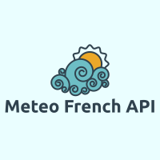

# Tech Specs

## Background

We build an API, called _Meteo French API_ that will serve weather information to worldwide connected watches.

The API will be integrated in an already existing backend environment hosted in the cloud and deployed with kubernetes.
The backend environment already has a authentication API OpenID Connect standard, a SQL database, a noSQL database and other APIs. Every watches has the ability to authenticate itself through the OpenID API and access APIs.

We have a `X` active watches that will be clients of the _Meteo French API_ and we estimate `XX` calls per day to our new API. Watches are used all over the world and we have `2` (1 in Europe/Paris, 1 in West USA California) backend environments deployed to support worldwide requests (asumption).

We also have 2 other environments for testing purpose :
* `test`:
To run automatic tests.
* `staging`:
To run manual and performance tests.

Our APIs are developped in Python with Flask framework and we follow a set of development rules, among them :
* document APIs with OpenAPI 3.0 standard
* python lint (TBD)
* unittests
* security mitigation

To develop _Meteo French API_ we will use a third party API dedicated to weather information

## Goals

## Non-goals

* We suppose we have a authentication micro-service with OpenID Connect standard and won't develop a authentication system. Our API will consume a JWT that will be generated by the authentication service beforehand.
* Due to planning restrictions, the work will focus on the code more than testing, security, deployment and monitoring process and performance optimization. But this document purpose is also to highlight weaknesses of the current implementation and propose improvements.

## Plan / Milestones

- [X] Register for ACCWEA and get to know the app with documentation
- [X] Create the structure of the API with APIFlask
- [X] Fill the structure with core logics from notebook
- [X] Generate the OpenAPI spec
- [X] Write unit tests for core logics functions
- [X] Write unit tests for API
- [X] Write `mfapi.yaml` k8s spec to deploy and test to deploy locally with `minikube`.

- [ ] package the app in an HELM chart
- [ ] CI pipeline
- [ ] JWT Authentication implemetation and unit tests
- [ ] Deployment in AKS in 1 `test` environment
- [ ] Configure an Autoscaler
- [ ] Static code analysis for security
- [ ] Integrate monitoring features (Sentry, ELK, Prometheus)

- [ ] Deployment in `staging`
- [ ] End-to-end validation in `staging` with connected watches *(need the API client development to be ready)*
- [ ] Load and performance tests in `staging`
- [ ] Deployment in `prod` worldwide
- [ ] Monitoring during _pilote_ period: The watch software version that include the weather client feature is deployed only on 10% of all the units
- [ ] Scale pilote: 10% (2 weeks) => 50% (2 weeks) => 100%
- [ ] CD pipeline

## KPI / Monitoring

* Sentry for logs

Grafana board (To be defined, we'll do the same as the other APIs) :
* Status codes (no-go if `2XX < 80%` ?)
* Time response per endpoint (objective: `200ms` ?)
* Requests history (per hour)
* Requests geography

Kibana board
* Requests per user id (info from JWT) => for security purpose to check they are known authenticated users.
* Lt/Lg (in request params) vizualisation ? => it might drive possible optimizations

## Improvement ideas

* Asynchronous calls to ACCWEA API
* Approximate lt and lg that will have the same weather information, and cache locationKey and weather info to respond faster. For example all `(lt, lg)` in the bounding box `[((48.87, 2.30)), ((48.88, 2.31))]` will be approximate to `(48.875, 2.305)` and will be considering having the same location key. This will help a lot because in a city there is a concentration of API clients (watches) which will get the same weather results.
* Approximation with a boundary box size in meters (because the conversion between lt or lg distance and meters distance is not constant, it depends on where you are on earth).
* parameter in the endpoint get request to choose the unit system (metric or imperial) to let the end user the possibility to set its 

## Open Questions

- [ ] How to store our ACCWEA Token securely ? `.env` files ? [git-secret](https://git-secret.io/)

